---
## Front matter
lang: ru-RU
title: Лабораторная работа №1
subtitle: Установка и конфигурация операционной системы на виртуальную машину
author:
  - Салькова Кристина Михайловна.
institute:
  - Российский университет дружбы народов, Москва, Россия

## i18n babel
babel-lang: russian
babel-otherlangs: english

## Formatting pdf
toc: false
toc-title: Содержание
slide_level: 2
aspectratio: 169
section-titles: true
theme: metropolis
header-includes:
 - \metroset{progressbar=frametitle,sectionpage=progressbar,numbering=fraction}
 - '\makeatletter'
 - '\beamer@ignorenonframefalse'
 - '\makeatother'
---

# Информация

## Докладчик

:::::::::::::: {.columns align=center}
::: {.column width="70%"}

  * Салькова Кристина Михайловна
  * НБИбд-02-22
  * Российский университет дружбы народов
 
:::
::: {.column width="30%"}

:::
::::::::::::::

# Вводная часть

## Цели и задачи

Целью данной работы является приобретение практических навыков
установки операционной системы на виртуальную машину, настройки ми-
нимально необходимых для дальнейшей работы сервисов.

## Материалы и методы

1. Установить VirtualBox. Linux, RedHat (64-bit). Rocky 
2. Выполнить задания.

# Выполнение лабораторной работы

# Установка VirtualBox

## 1

Загрузите в дисплейном классе операционную систему Linux. Осуществите
вход в систему. Запустите терминал. Перейдите в каталог /var/tmp. Создайте каталог с именем пользователя.

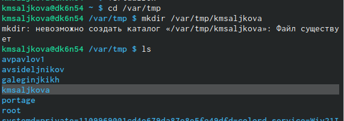{#fig:001 width=70%}

## 2

Указываем месторасположеине каталога для виртуальных машин.

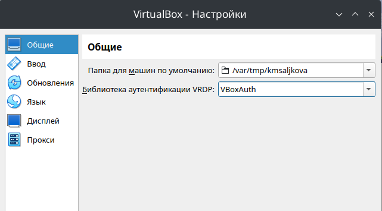{#fig:002 width=70%}

## 3

Создаем новую виртуальную машину. Указываем имя виртуальной машины 
тип операционной системы — Linux, RedHat (64-bit) 
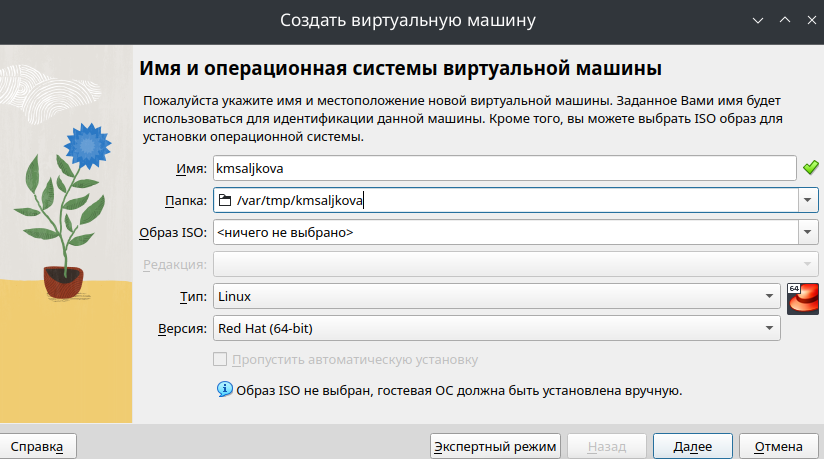{#fig:003 width=70%}

## 4

Укажите размер основной памяти виртуальной машины — 2048
МБ 

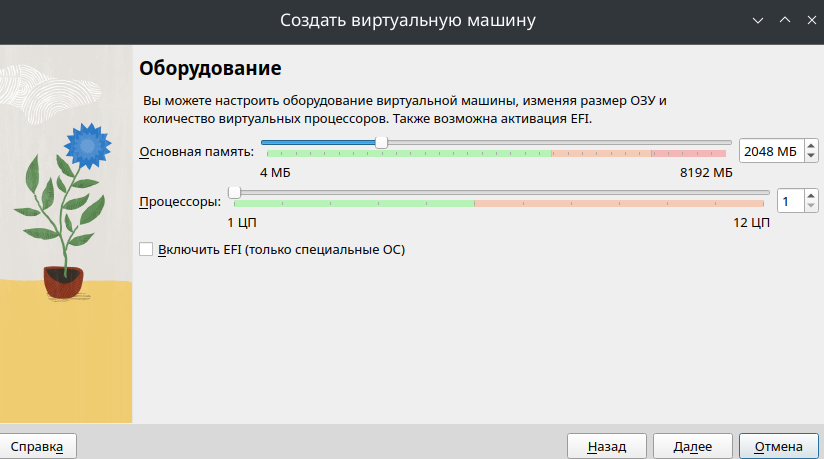{#fig:004 width=70%}

## 5

Конфигурация 

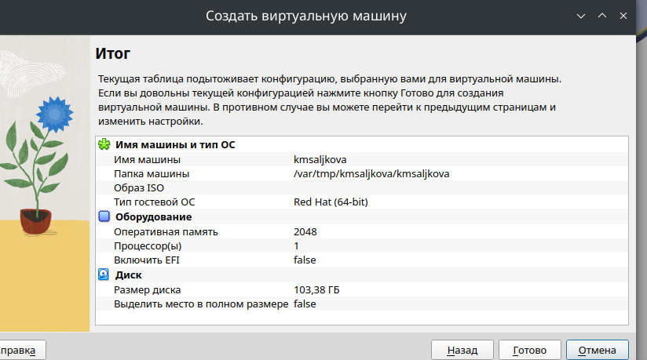{#fig:005 width=70%}

## 6
Добавим новый привод оптических дисков и выберите образ
операционной системы 

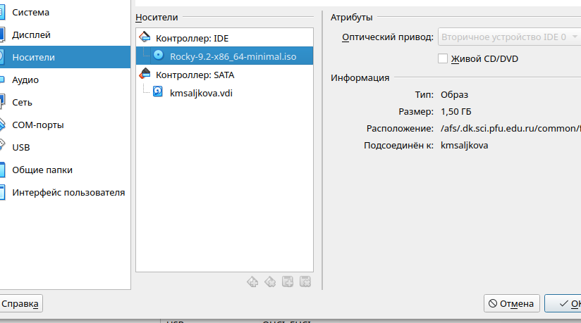{#fig:006 width=70%}

## 7
Запуск ВМ 

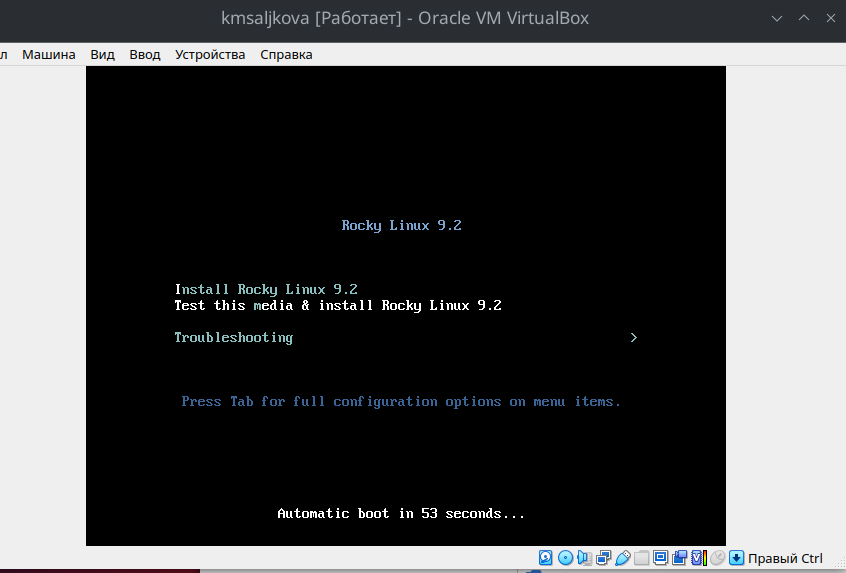{#fig:007 width=70%}

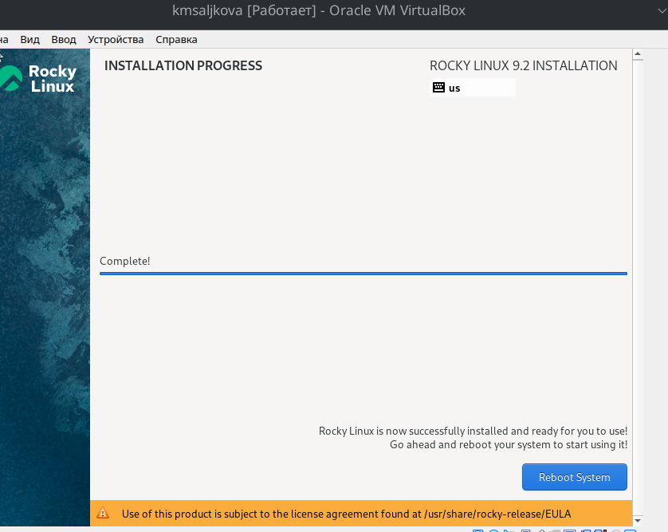{#fig:008 width=70%}

# Выполнение задания

## 
1. Версия ядра Linux (Linux version).

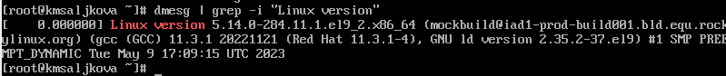{#fig:009 width=70%}

##
 
2. Частота процессора (Detected Mhz processor).
3. Модель процессора (CPU0).

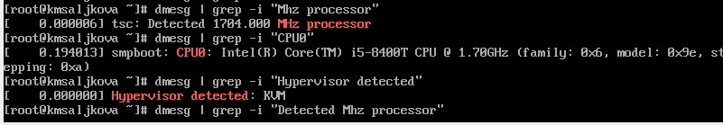{#fig:010 width=70%}

## 

4. Объем доступной оперативной памяти (Memory available). Нужно ввести команду available
(скриншот не сохранился)
5. Тип обнаруженного гипервизора (Hypervisor detected).
6. Тип файловой системы корневого раздела.

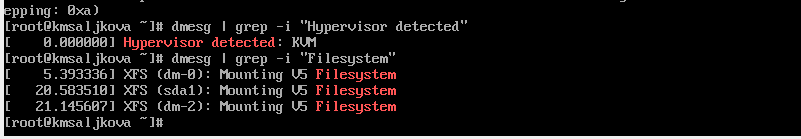{#fig:011 width=70%}

## 
7. Последовательность монтирования файловых систем.

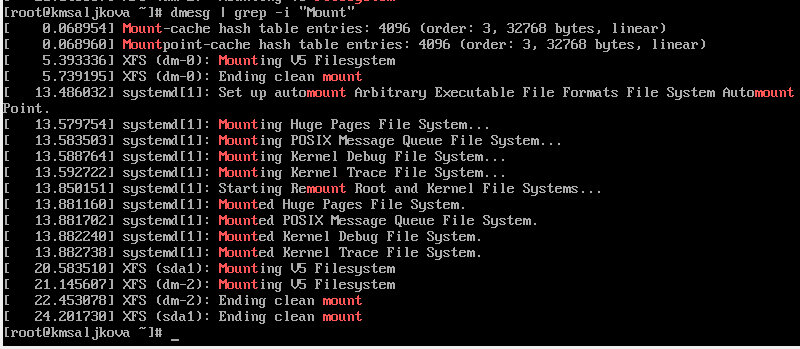{#fig:012 width=70%}

## Результаты

В ходе работы я приобрела практические навыки
установки операционной системы на виртуальную машину, настройки минимально
необходимых для дальнейшей работы сервисов.

:::

