---
## Front matter
lang: ru-RU
title: Лабораторная работа №3
subtitle: Дискреционное разграничение прав в Linux. Два пользователя
author:
  - Салькова К.М.
institute:
  - Российский университет дружбы народов, Москва, Россия
date: 14 марта 2024

## i18n babel
babel-lang: russian
babel-otherlangs: english

## Formatting pdf
toc: false
toc-title: Содержание
slide_level: 2
aspectratio: 169
section-titles: true
theme: metropolis
header-includes:
 - \metroset{progressbar=frametitle,sectionpage=progressbar,numbering=fraction}
 - '\makeatletter'
 - '\beamer@ignorenonframefalse'
 - '\makeatother'
---

# Информация

## Докладчик

:::::::::::::: {.columns align=center}
::: {.column width="70%"}

  * Салькова Кристина Михайловна
  * студентка группы НБИбд-02-22
  * Российский университет дружбы народов
  
:::
::: {.column width="30%"}

:::
::::::::::::::

## Цели и задачи

Получение практических навыков работы в консоли с атрибутами файлов для групп пользователей

## Содержание исследования

1. Создаем учетную запись для пользователя guest2.

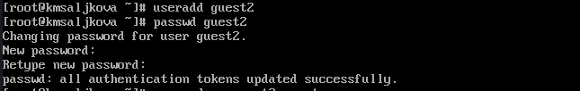{#fig:001 width=70%}

##

2. Добавляем пользователя guest2 в группу guest.

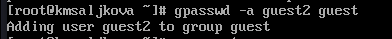{#fig:002 width=70%}

##

3. Определяем директории для обоих пользователей с помощью команды pwd, также уточняем имя пользователя, его группу, кто в неё входит и к каким группам принадлежит.

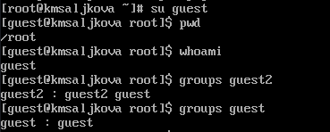{#fig:003 width=70%}

##

{#fig:004 width=70%}

##

4. Сравним выводы команды groups с командами id -Gn и id -G.

Сравнивая вывод id с выводом команды groups, обнаружим, что группы, в которые входит пользователь, действительно одинаковые. Также, сравнивая вывод id c приглашением командной строки, обнаружим, что имя пользователя повторяется. 

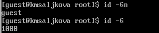{#fig:005 width=70%}

##

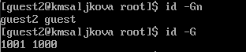{#fig:006 width=70%}

##

5. Просмотрим файл /etc/group для обоих пользователей с помощью cat /etc/group и сравним данные uid, gid с результатами команд выше и выясним, что данные значения совпадают.

{#fig:007 width=70%}

##

{#fig:008 width=70%}

##

6. От имени пользователя guest2 выполняем регистрацию пользователя guest2 в группе guest командой newgrp guest.

{#fig:009 width=70%}

##

7. От имени пользователя guest изменим права директории /home/guest, разрешив все действия для пользователей группы.

{#fig:010 width=70%}

##

8. От имени пользователя guest снимите с директории /home/guest/dir1 все атрибуты.

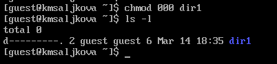{#fig:011 width=70%}

##

9. Заполняем таблицу 3.1 "Установленные права и разрешенные действия".

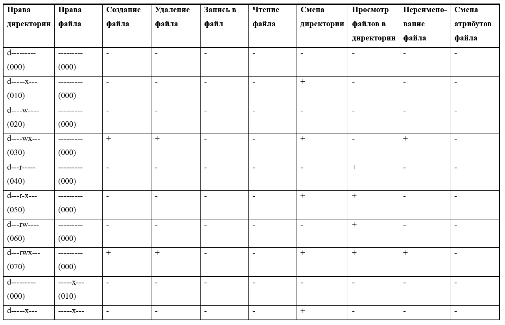{#fig:012 width=70%}

##

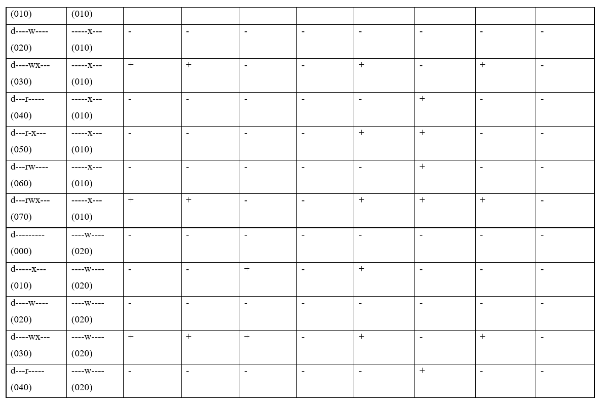{#fig:013 width=70%}

##

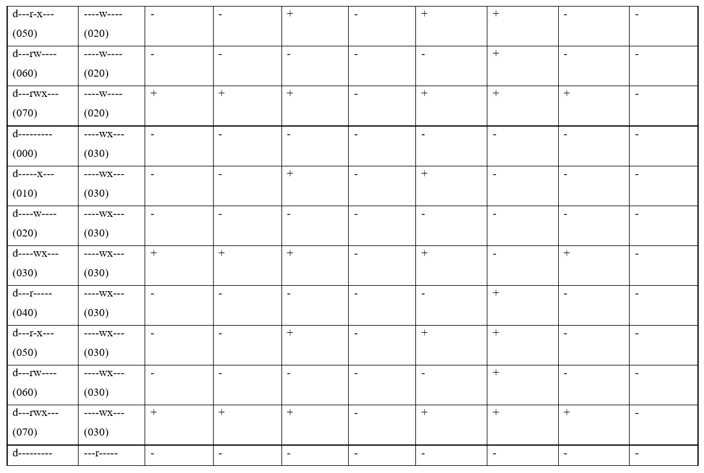{#fig:014 width=70%}

##

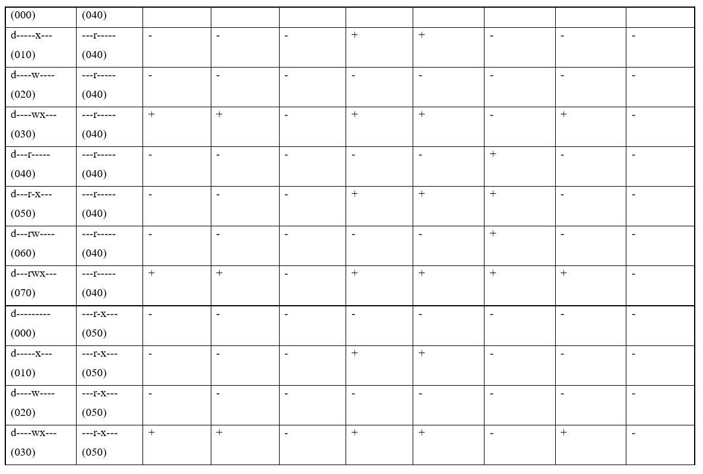{#fig:015 width=70%}

##

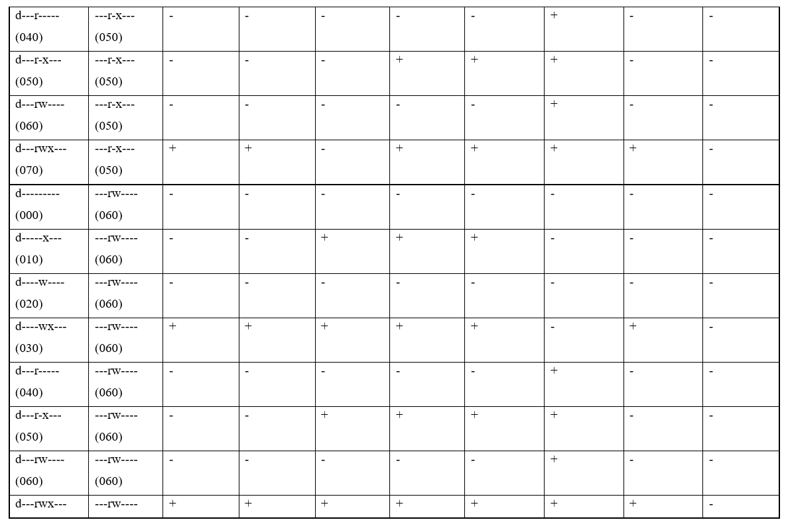{#fig:016 width=70%}

##

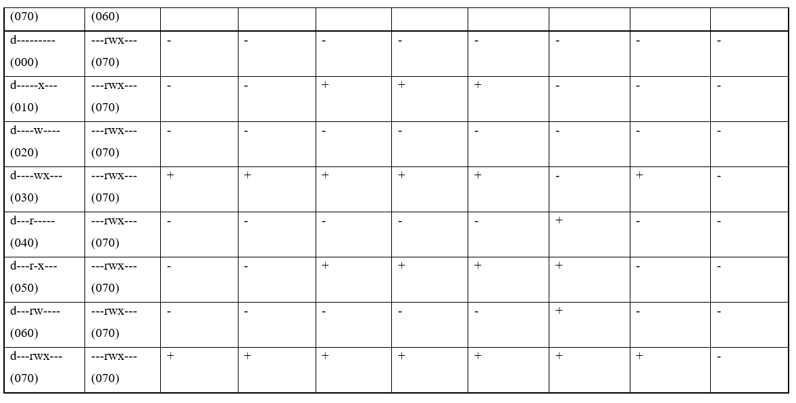{#fig:017 width=70%}

##

10. Заполняем таблицу 3.2 "Минимальные права для совершения операций от имени пользователей входящих в группу"

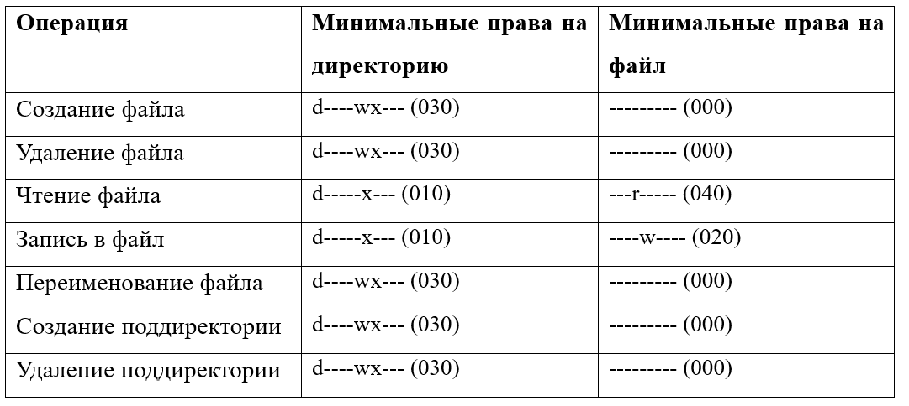{#fig:018 width=70%}

## Результаты

- Получили практические навыки работы в консоли с атрибутами файлов для групп пользователей

:::
