---
## Front matter
title: "Лабораторная работа №3"
subtitle: "Дискреционное разграничение прав в Linux. Два пользователя"
author: "Салькова Кристина Михайловна"

## Generic otions
lang: ru-RU
toc-title: "Содержание"

## Bibliography
bibliography: bib/cite.bib
csl: pandoc/csl/gost-r-7-0-5-2008-numeric.csl

## Pdf output format
toc: true # Table of contents
toc-depth: 2
lof: true # List of figures
lot: true # List of tables
fontsize: 12pt
linestretch: 1.5
papersize: a4
documentclass: scrreprt
## I18n polyglossia
polyglossia-lang:
  name: russian
  options:
	- spelling=modern
	- babelshorthands=true
polyglossia-otherlangs:
  name: english
## I18n babel
babel-lang: russian
babel-otherlangs: english
## Fonts
mainfont: PT Serif
romanfont: PT Serif
sansfont: PT Sans
monofont: PT Mono
mainfontoptions: Ligatures=TeX
romanfontoptions: Ligatures=TeX
sansfontoptions: Ligatures=TeX,Scale=MatchLowercase
monofontoptions: Scale=MatchLowercase,Scale=0.9
## Biblatex
biblatex: true
biblio-style: "gost-numeric"
biblatexoptions:
  - parentracker=true
  - backend=biber
  - hyperref=auto
  - language=auto
  - autolang=other*
  - citestyle=gost-numeric
## Pandoc-crossref LaTeX customization
figureTitle: "Рис."
tableTitle: "Таблица"
listingTitle: "Листинг"
lofTitle: "Список иллюстраций"
lotTitle: "Список таблиц"
lolTitle: "Листинги"
## Misc options
indent: true
header-includes:
  - \usepackage{indentfirst}
  - \usepackage{float} # keep figures where there are in the text
  - \floatplacement{figure}{H} # keep figures where there are in the text
---

# Цель работы

Получение практических навыков работы в консоли с атрибутами файлов для групп пользователей

# Теоретическое введение

Более подробно про Unix см. в [@tanenbaum_book_modern-os_ru; @robbins_book_bash_en; @zarrelli_book_mastering-bash_en; @newham_book_learning-bash_en]. 

# Выполнение лабораторной работы

1. Создаём учётную запись для пользователя guest2 (рис. [-@fig:001]).

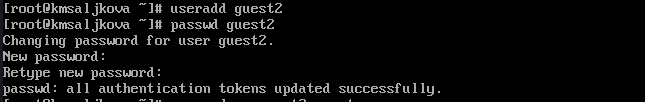{#fig:001 width=70%}

2. Добавляем пользователя guest2 в группу guest (рис. [-@fig:002]).

{#fig:002 width=70%}

3. Определяем директории для обоих пользователей с помощью команды pwd, также уточняем имя пользователя, его группу, кто в неё входит и к каким группам принадлежит (рис. [-@fig:003]), (рис. [-@fig:004]).

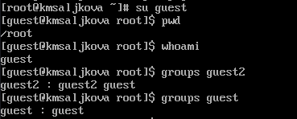{#fig:003 width=70%}

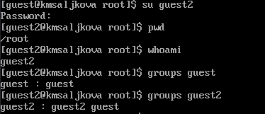{#fig:004 width=70%}

4. Сравним выводы команды groups с командами id -Gn и id -G (рис. [-@fig:005]), (рис. [-@fig:006]).

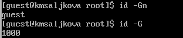{#fig:005 width=70%}

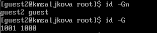{#fig:006 width=70%}

5. Просмотрим файл /etc/group для обоих пользователей с помощью cat /etc/group и сравним данные uid, gid с результатами команд выше и выясним, что данные значения совпадают (рис. [-@fig:007]), (рис. [-@fig:008]).

{#fig:007 width=70%}

{#fig:008 width=70%}

6. От имени пользователя guest2 выполняем регистрацию пользователя guest2 в группе guest командой newgrp guest (рис. [-@fig:009]).

{#fig:009 width=70%}

7. От имени пользователя guest изменим права директории /home/guest, разрешив все действия для пользователей группы (рис. [-@fig:010]).

{#fig:010 width=70%}

8. От имени пользователя guest снимите с директории /home/guest/dir1 все атрибуты (рис. [-@fig:011]).

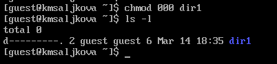{#fig:011 width=70%}

9. Заполняем таблицу 3.1 "Установленные права и разрешенные действия" (рис. [-@fig:012]), (рис. [-@fig:013]), (рис. [-@fig:014]), (рис. [-@fig:015]), (рис. [-@fig:016]), (рис. [-@fig:017]).

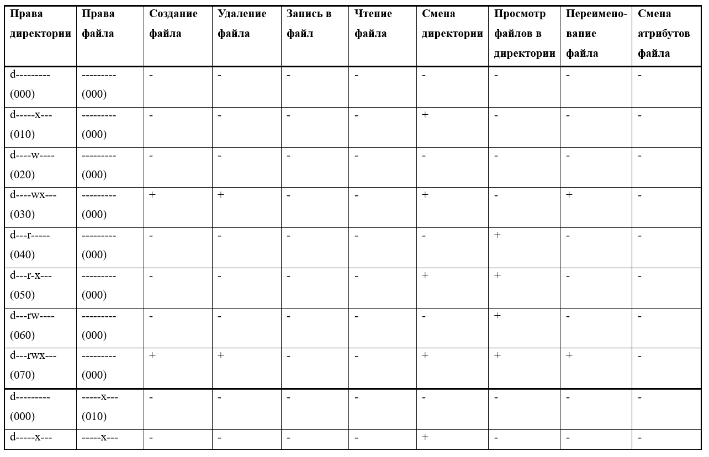{#fig:012 width=70%}

{#fig:013 width=70%}

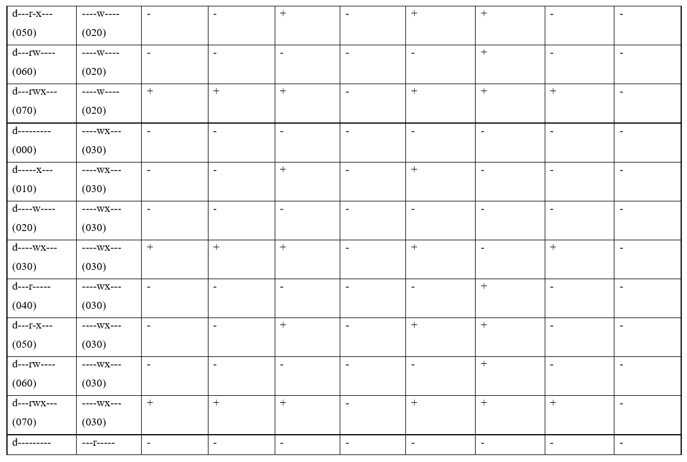{#fig:014 width=70%}

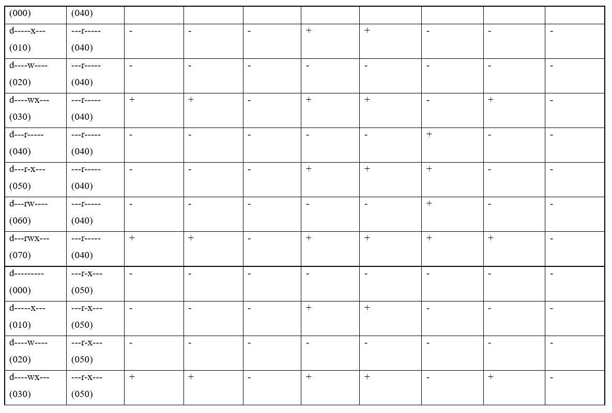{#fig:015 width=70%}

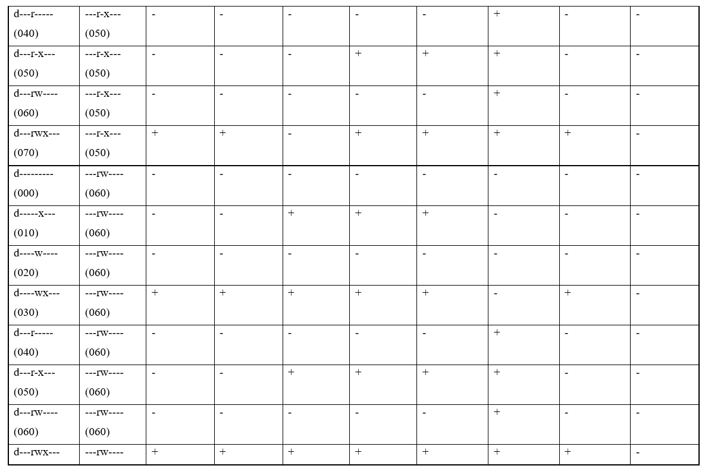{#fig:016 width=70%}

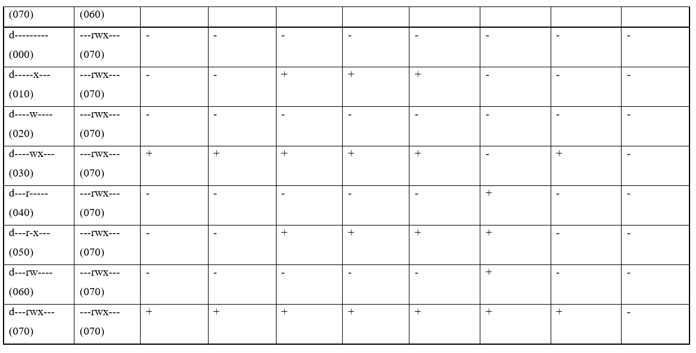{#fig:017 width=70%}

10. Заполняем таблицу 3.2 "Минимальные права для совершения операций от имени пользователей входящих в группу" (рис. [-@fig:018])

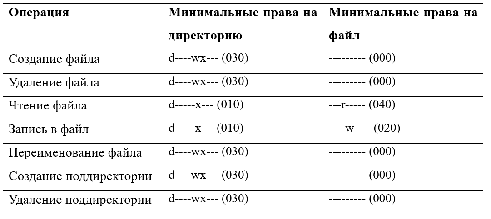{#fig:018 width=70%}

# Выводы

Получили практические навыки работы в консоли с атрибутами файлов для групп пользователей

# Список литературы{.unnumbered}

Более подробно про Unix см. в [@tanenbaum_book_modern-os_ru; @robbins_book_bash_en; @zarrelli_book_mastering-bash_en; @newham_book_learning-bash_en].

::: {#refs}
:::
