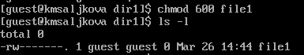
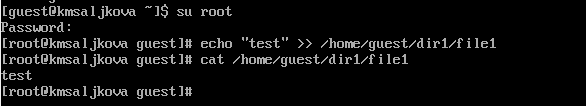
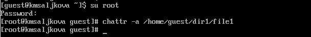
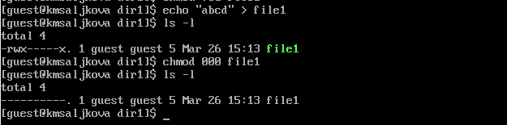

---
## Front matter
lang: ru-RU
title: Лабораторная работа №5
subtitle: "Дискреционное разграничение прав в Linux. Исследование влияния дополнительных атрибутов"
author:
  - Салькова К.М.
institute:
  - Российский университет дружбы народов, Москва, Россия
date: 12 апреля 2024

## i18n babel
babel-lang: russian
babel-otherlangs: english

## Formatting pdf
toc: false
toc-title: Содержание
slide_level: 2
aspectratio: 169
section-titles: true
theme: metropolis
header-includes:
 - \metroset{progressbar=frametitle,sectionpage=progressbar,numbering=fraction}
 - '\makeatletter'
 - '\beamer@ignorenonframefalse'
 - '\makeatother'
---

# Информация

## Докладчик

:::::::::::::: {.columns align=center}
::: {.column width="70%"}

  * Салькова Кристина Михайловна
  * студентка группы НБИбд-02-22
  * Российский университет дружбы народов
  
:::
::: {.column width="30%"}

:::
::::::::::::::

## Цели и задачи

Изучение механизмов изменения идентификаторов, применения
SetUID- и Sticky-битов. Получение практических навыков работы в консоли с дополнительными атрибутами. Рассмотрение работы механизма смены идентификатора процессов пользователей, а также влияние бита
Sticky на запись и удаление файлов.

## Содержание исследования

## 
1. От имени пользователя guest определите расширенные атрибуты файла /home/guest/dir1/file1 командой lsattr /home/guest/dir1/file1
{#fig:001 width=70%}

## 
2. Установите командой
chmod 600 file1
на файл file1 права, разрешающие чтение и запись для владельца файла.

{#fig:002 width=70%}

## 
3. Попробуем установить на файл /home/guest/dir1/file1 расширенный атрибут a от имени пользователя guest:
chattr +a /home/guest/dir1/file1
В ответ получаем отказ от выполнения операции.

{#fig:003 width=70%}

## 
4. Повысим свои права с помощью команды su. Попробуем установить расширенный атрибут a на файл /home/guest/dir1/file1 от имени суперпользователя 

{#fig:004 width=70%}

## 
5. От пользователя guest проверим правильность установления атрибута:
lsattr /home/guest/dir1/file1 

{#fig:005 width=70%}

## 
6. Выполним дозапись в файл file1 слова «test» командой
echo "test" /home/guest/dir1/file1
После этого выполним чтение файла file1 командой
cat /home/guest/dir1/file1
Убедимся, что слово test было успешно записано в file1. 

{#fig:006 width=70%}

## 

7. Попробуем удалить файл file1 либо стереть имеющуюся в нём информацию командой. Попробуем переименовать файл
echo "abcd" > /home/guest/dirl/file1 

{#fig:007 width=70%}

## 
8. Попробуем с помощью команды chmod 000 file1 установить на файл file1 права, например, запрещающие чтение и запись для владельца файла. "Удалось ли вам успешно выполнить указанные команды?" Нет 

{#fig:008 width=70%}

## 
9. Снимим расширенный атрибут a с файла /home/guest/dirl/file1 от имени суперпользователя командой
chattr -a /home/guest/dir1/file1 

{#fig:009 width=70%}

## 
10. Повторим операции, которые нам ранее не удавалось выполнить. 

{#fig:010 width=70%}

## Результаты

Мы изучили механизмы изменения идентификаторов, примененили
SetUID- и Sticky-биты. Получили практические навыки работы в консоли с дополнительными атрибутами. Рассмотрели работы механизма смены идентификатора процессов пользователей, а также влияние бита
Sticky на запись и удаление файлов.

:::
